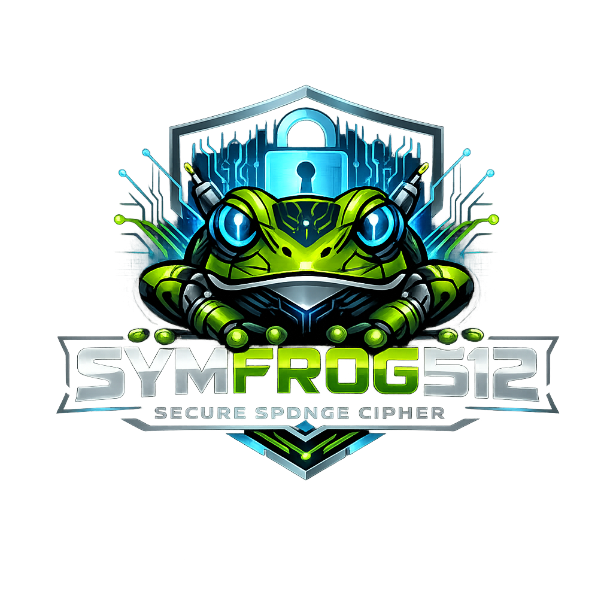

# 🐸 SymFrog-512

## High-Capacity Sponge-Based AEAD Cipher (1024-bit State)

<p align="center">
  
</p>

<p align="center">
  <b>SymFrog-512</b> is a sponge-duplex authenticated encryption design built around a 1024-bit internal state, engineered for conservative margins, file safety, and practical usability.
</p>

<p align="center">
  <a href="https://github.com/victormeloasm/symfrog512/releases/tag/v1.0">Release v1.0</a>
  ·
  <a href="#-download">Download</a>
  ·
  <a href="#-build">Build</a>
  ·
  <a href="#-usage">Usage</a>
  ·
  <a href="#-security-model--claims">Security</a>
</p>

---

## ⭐ Highlights

* 🔐 **AEAD (Authenticated Encryption with Associated Data)** for files and streams
* 🧽 **Sponge Duplex** with **1024-bit state** (rate 512, capacity 512)
* 🏷️ **256-bit authentication tag**
* 🧂 **Salt + Argon2id** password-based key derivation mode
* 🔑 **Raw-key mode** for high-entropy keys
* 🧾 **Authenticated header** to protect metadata integrity before decrypting
* 💾 **Atomic, crash-safe file writes** (tmp → fsync → rename)
* 🧠 **Secure memory handling** (`sodium_mlock`, explicit zeroization)
* 🧪 **`--test-all`** suite with boundary, tamper, truncation and large-size coverage
* 🐍 Optional offline inspection tooling (header + structure validation)

---

# 📦 Download

✅ Prebuilt Linux x86_64 binary release:

**[https://github.com/victormeloasm/symfrog512/releases/download/v1.0/symfrog512-linux-x86_64.tar.gz](https://github.com/victormeloasm/symfrog512/releases/download/v1.0/symfrog512-linux-x86_64.tar.gz)**

Extract:

```bash
tar -xzf symfrog512-linux-x86_64.tar.gz
chmod +x symfrog512
./symfrog512 --help
```

---

# 🧠 What SymFrog-512 Is (and Is Not)

SymFrog-512 is a **research-grade** cipher implementation focusing on:

* large internal state
* conservative separation of rate/capacity
* authenticated file format
* durable file writes
* clarity and reproducibility

It is not a standardized primitive (like AES-GCM or ChaCha20-Poly1305).
It is meant for research, experimentation, and transparent engineering.

---

# 🧽 Design Overview

## Sponge Duplex Construction

SymFrog-512 uses a duplex sponge approach:

* data is absorbed into the state
* state is permuted
* output keystream/tag is derived from the state

The internal state is split into two conceptual parts:

* **Rate (r)**: the part that interacts with plaintext/ciphertext and AD
* **Capacity (c)**: the hidden security margin that is never directly exposed

### Parameters

* **State size**: 1024 bits
* **Rate**: 512 bits
* **Capacity**: 512 bits
* **Rounds**: 24
* **Nonce**: 256 bits
* **Tag**: 256 bits

---

# 🔐 Security Model & Claims

## Practical security level

SymFrog-512 targets:

* **Up to 256-bit effective security** against generic AEAD forgery and confidentiality attacks
* **2⁻²⁵⁶** generic forgery probability from a 256-bit tag (best-case bound)

### Why not “512-bit real security”?

Even with 512-bit capacity, **AEAD security is bounded by the tag size** and generic birthday-style limits in realistic attack models.

So the honest, paper-grade claim is:

* **Confidentiality and authenticity target: 256-bit**, assuming the permutation behaves as a secure PRP and nonces are not reused with the same key.

This is already far beyond conventional deployment needs (AES-256 is generally “enough for the universe”).

---

# 🧱 P1024 Permutation Engine

SymFrog-512’s core permutation runs for **24 rounds**.

Each round is structured to provide:

* high diffusion across the entire 1024-bit state
* strong non-linearity
* symmetry breaking
* avoidance of trivial invariants
* deterministic, reproducible constants

### Round constants

Round constants are derived deterministically via SHAKE256 to prevent:

* weak constants
* accidental symmetry
* hidden “handpicked” constants concerns

---

# 🧾 File Format (On-Disk)

SymFrog-512 stores ciphertexts in a file container with an authenticated header.

### High-level structure

```
+----------------------------+
| Header (fixed size)        |
|  magic, version, flags     |
|  salt (optional)           |
|  nonce                     |
|  ct_len                    |
|  reserved                  |
|  header_tag (256-bit)      |
+----------------------------+
| Ciphertext (ct_len bytes)  |
+----------------------------+
| Final Tag (256-bit)        |
+----------------------------+
```

### Why an authenticated header?

It prevents attacks where an adversary modifies metadata (nonce, salt, flags, length, version) to force:

* undefined behavior
* oracle-like error leaks
* confusion about parameters
* downgrade or cross-file substitution

In SymFrog, the header is cryptographically bound before decryption proceeds.

---

# 🧷 Associated Data (AD)

Associated Data is authenticated but not encrypted.

Use cases:

* filenames
* protocol metadata
* file-type identifiers
* user IDs
* structured context

If AD changes, decryption must fail.

---

# 🔑 Key Modes & Guidance

SymFrog supports:

## Password mode (Argon2id)

* Designed for human passphrases
* Uses a salt stored in the header
* Provides memory-hard defense against offline guessing

✅ Best for usability.

## Raw-key mode

* For high-entropy keys (generated, not typed)
* Useful for automation, CI, or key vaults
* Avoids KDF cost

✅ Best for controlled environments.

---

# 🧨 Nonce Guidance (Important)

Nonce must be **unique per encryption under the same key**.

* Password mode: salts differ per file, which reduces same-key reuse risk, but you still should not intentionally reuse nonce with identical derived keys.
* Raw-key mode: treat nonce uniqueness as mandatory.

The test harness may use deterministic nonce values (for reproducibility).
That is normal in tests, not in production usage.

---

# 💾 Atomic File Safety & Reliability

Encryption output is written using a safe sequence:

1. write to temp file in the destination directory
2. flush with `fsync`
3. atomically rename to final filename

This prevents:

* corrupted ciphertext on crash/power loss
* half-written outputs
* inconsistent states on disk

---

# 🧪 Tests

Run the full test suite:

```bash
./symfrog512 --test-all
```

Typical coverage includes:

* size 0, 1, 2 bytes
* boundary sizes around rate/padding points
* large file tests
* wrong password/key rejection
* tampered ciphertext rejection
* tampered header rejection
* truncation rejection

If tests fail, it usually means:

* missing deps
* file permission issues
* a regression in header/tag handling
* incorrect build flags or ABI mismatch

---

# 🐍 Offline Structure Validation Tool

If you include the inspection script (recommended for debugging and reproducibility), it can verify:

* magic/version
* flags
* header sizes
* computed ciphertext length consistency
* detection of truncated outputs
* detection of duplicate nonces across artifacts

Example:

```bash
python3 tools/symfrog_inspect.py symfrog_test_out
```

This does **not** decrypt. It validates structure and invariants.

---

# 🛠 Build

## Dependencies

### Ubuntu / Debian

```bash
sudo apt update
sudo apt install -y clang lld make pkg-config libsodium-dev libssl-dev python3
```

## Build with Clang + LLD (recommended)

```bash
clang++ -std=c++20 -O3 -march=native -mtune=native -flto -fuse-ld=lld -pipe \
  symfrog512.cpp -o symfrog512 \
  -lsodium -lssl -lcrypto
```

## Build with strict warnings (debug-friendly)

```bash
clang++ -std=c++20 -O2 -g -fno-omit-frame-pointer -fuse-ld=lld -pipe \
  -Wall -Wextra -Wpedantic -Wshadow -Wconversion -Wsign-conversion -Wformat=2 \
  symfrog512.cpp -o symfrog512 \
  -lsodium -lssl -lcrypto
```

---

# 🚀 Usage

Because CLI flags can evolve, always check:

```bash
./symfrog512 --help
```

Typical flows:

## Encrypt a file

* choose password mode OR raw-key mode
* optionally add AD
* generate ciphertext `.syf`

## Decrypt a file

* same password or key
* same AD

### Example workflow template

```bash
# Encrypt
./symfrog512 encrypt input.bin output.syf --password "your-passphrase" --ad "context"

# Decrypt
./symfrog512 decrypt output.syf recovered.bin --password "your-passphrase" --ad "context"
```

Raw key template:

```bash
./symfrog512 encrypt input.bin output.syf --raw-key <HEXKEY> --ad "context"
./symfrog512 decrypt output.syf recovered.bin --raw-key <HEXKEY> --ad "context"
```

---

# 📚 Threat Model

SymFrog-512 aims to protect against:

✅ Passive attackers

* can read ciphertext
* cannot decrypt without key

✅ Active attackers

* can tamper with ciphertext/header
* should be detected with overwhelming probability

✅ Offline brute force of passwords

* mitigated by Argon2id KDF parameters

Not guaranteed by design (out of scope):

* compromised endpoints
* keyloggers
* malicious OS or RAM scraping
* side-channel resistant constant-time proof for all paths (depends on platform/build)

---

# ⚠️ Common Pitfalls

## Reusing nonce with the same key

This is the fastest way to break stream-like designs.
Do not do it.

## Wrong AD

AD must match. If AD differs, authentication must fail.

## Changing the code breaks compatibility

Round constants, header format, tag derivation are part of the protocol.
If you change them, old ciphertext may become undecryptable.

---

# 🧩 FAQ

### Is this “better than AES-GCM”?

Not as a standardized primitive. AES-GCM is deeply analyzed and hardware accelerated.
SymFrog-512 is for research and paranoid experimentation with a large sponge state.

### Why 1024-bit state?

A large state provides conservative security margin and makes many generic attacks impractical, especially in multi-target settings.

### Is the cipher “proven secure”?

No. Like almost all practical ciphers, it relies on structural assumptions plus analysis. The intended claims are conservative (256-bit target).

### Can I use it in production?

Only if you accept the risk of a non-standard primitive and conduct independent review. Use AES-GCM or ChaCha20-Poly1305 for standard production needs.

---

# 🗺 Roadmap

Ideas for future versions:

* More formal spec document (protocol + test vectors)
* Known-answer tests (KAT) published in repo
* Deterministic test vector generator
* CI pipeline with reproducible builds
* Side-channel review checklist
* Additional platforms (aarch64)
* Performance benchmarks and profiles

---

# 🤝 Contributing

Contributions are welcome:

* cryptanalysis notes
* reduced-round analysis
* differential/linear trail searches
* fuzzing and robustness tests
* portability improvements
* documentation improvements

Open an issue with:

* build flags
* OS + compiler version
* reproduction steps
* sample file if needed

---

# 📄 License

**MIT License**
See `LICENSE`.

---

# 🐸 Author

**Victor Duarte Melo**
Independent Research

---

## ✅ Quick Checklist

* Download: ✅
* Build: ✅
* Test: ✅ (`--test-all`)
* Encrypt: ✅
* Decrypt: ✅
* Validate structure: ✅
* Package release: ✅
* MIT: ✅

