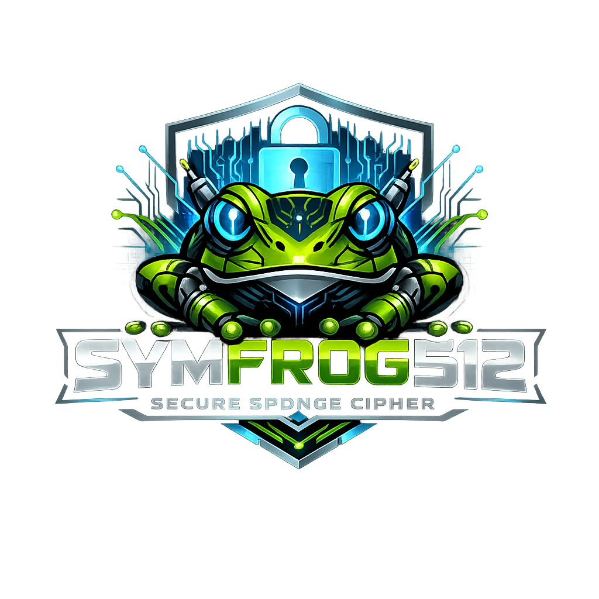

# 🐸 SymFrog-512

**Experimental sponge-duplex AEAD with a 1024-bit state**

<p align="center">
  
</p>

SymFrog-512 is a research implementation of authenticated file encryption built around the custom **P1024-v2** permutation. The current code writes the **hardened file format v2** and retains read compatibility with legacy v1 files.

> **Important:** SymFrog-512 is a non-standard, independently designed primitive. It has not received the depth of public cryptanalysis enjoyed by AES-GCM, ChaCha20-Poly1305, or Ascon. Use a standardized AEAD for production systems unless an independent review explicitly accepts this risk.

## Current parameters

| Parameter | Value |
|---|---:|
| Permutation state | 1024 bits |
| Rate / capacity | 512 / 512 bits |
| Rounds | 24 |
| Raw key | 1024 bits (128 bytes) |
| Nonce | 256 bits (32 bytes) |
| Final tag | 256 bits (32 bytes) |
| Stored password salt | 256 bits (32 bytes) |
| File header | 152 bytes |

The large state and tag are conservative parameters, not proof of a particular real-world security level. Security still depends on the structure of P1024-v2, the duplex mode, implementation correctness, nonce discipline, and independent analysis.

## Hardened format v2

New encryptions use header version `0x00000002`. Major changes from legacy v1:

- protocol-version separation is injected into the initial state;
- the final padded ciphertext block receives explicit `DS_CT` domain separation;
- all 32 stored salt bytes are committed into the effective Argon2id salt;
- the Argon2id profile is stored in the authenticated header, with explicit opt-in required before honoring SENSITIVE memory cost;
- unknown flags, malformed KDF metadata, non-zero unused fields, and length mismatches are rejected;
- decryption authenticates the full ciphertext **before creating plaintext output** and verifies it again during the decryption pass;
- input symlinks are rejected with `O_NOFOLLOW`;
- existing outputs are not replaced unless `--force` is supplied;
- passphrases can be read from `/dev/tty` or a protected file instead of appearing in process arguments;
- secret files must have mode `0600` or stricter;
- all-zero raw keys are rejected;
- deterministic nonce overrides require an explicit unsafe-use acknowledgement.

Legacy v1 decryption is preserved. v1 password files did not encode their Argon2id profile, so `--paranoid` must still be supplied when decrypting a v1 file originally created with the historical SENSITIVE profile.

## Dependencies

Ubuntu / Debian:

```bash
sudo apt update
sudo apt install -y clang lld make pkg-config libsodium-dev libssl-dev python3
```

## Build

The repository includes a `Makefile`.

```bash
make release
```

CPU-specific optimized build:

```bash
make native
```

Debug and sanitizer builds:

```bash
make debug
make sanitize
```

Manual release build:

```bash
clang++ -std=c++23 -O3 -flto -fuse-ld=lld -fno-rtti \
  -D_FORTIFY_SOURCE=3 -D_GLIBCXX_ASSERTIONS \
  -fstack-protector-strong -fstack-clash-protection -fPIE \
  -Wall -Wextra -Wpedantic -Wshadow -Wconversion -Wsign-conversion -Wformat=2 \
  src/symfrog512.cpp -o symfrog512 \
  -pie -Wl,-z,relro,-z,now -Wl,-z,noexecstack \
  -lsodium -lcrypto
```

The program uses C++ exceptions. Do **not** compile it with `-fno-exceptions`.

## Recommended usage

### Password mode

Prompt securely through `/dev/tty`:

```bash
./symfrog512 enc secret.bin secret.syf --pass-prompt
./symfrog512 dec secret.syf recovered.bin --pass-prompt
```

The encryption prompt asks twice for confirmation. The passphrase is not echoed.

A passphrase file is also supported:

```bash
chmod 600 passphrase.txt
./symfrog512 enc secret.bin secret.syf --pass-file passphrase.txt
./symfrog512 dec secret.syf recovered.bin --pass-file passphrase.txt
```

One trailing LF and optional CR are stripped. An empty passphrase is rejected.

Use the SENSITIVE Argon2id profile for a new file:

```bash
./symfrog512 enc secret.bin secret.syf --pass-prompt --paranoid
```

The selected profile is stored in the authenticated v2 header. Because that metadata cannot be authenticated until after key derivation, decrypting a file that requests the SENSITIVE profile requires an explicit `--paranoid` opt-in. This prevents an attacker-controlled header from silently forcing the highest-memory KDF.

```bash
./symfrog512 dec secret.syf recovered.bin --pass-prompt --paranoid
```

### Raw-key mode

Generate a 128-byte key and protect it carefully:

```bash
umask 077
head -c 128 /dev/urandom > symfrog.key
./symfrog512 enc secret.bin secret.syf --key-file symfrog.key
./symfrog512 dec secret.syf recovered.bin --key-file symfrog.key
```

`--key-file` accepts either exactly 128 raw bytes or exactly 256 hexadecimal characters, with surrounding whitespace ignored in hex mode. Secret files must be mode `0600` or stricter, and an all-zero raw key is rejected as a likely initialization mistake.


### Deterministic nonce override

Normal encryption generates a fresh random 256-bit nonce. `--nonce-hex` exists only for reproducible test vectors and is deliberately gated:

```bash
./symfrog512 enc input.bin vector.syf --key-file symfrog.key \
  --nonce-hex 000102030405060708090a0b0c0d0e0f101112131415161718191a1b1c1d1e1f \
  --allow-unsafe-nonce
```

Never reuse a nonce with the same key. Nonce reuse can reveal XOR relations between plaintexts and invalidates the intended confidentiality guarantees.

### Associated data

Associated data is hexadecimal and must match during decryption:

```bash
./symfrog512 enc secret.bin secret.syf --pass-prompt --ad 486561646572
./symfrog512 dec secret.syf recovered.bin --pass-prompt --ad 486561646572
```

### Output replacement

SymFrog refuses to overwrite an existing output by default:

```bash
./symfrog512 dec secret.syf recovered.bin --pass-prompt --force
```

`--force` performs an atomic replacement after the new output is completely written and synchronized.

### Legacy argv options

`--pass` and `--key-hex` remain for compatibility, but they may leak secrets through shell history, `/proc`, process monitors, logs, or crash reports. Prefer `--pass-prompt`, `--pass-file`, and `--key-file`.

## File layout

```text
magic[8] | version[4] | flags[4] | salt[32] | nonce[32]
ct_len[8] | reserved[32] | header_tag[32]
ciphertext[ct_len] | final_tag[32]
```

All integers are little-endian. The header tag authenticates the complete header with its tag field zeroed, plus external associated data.

For v2 password files, `reserved` is:

```text
"KDF2" | profile[1] | zero[27]
```

Profiles currently accepted:

- `1`: libsodium Argon2id MODERATE
- `2`: libsodium Argon2id SENSITIVE

Raw-key files require both `salt` and `reserved` to be all-zero.

## Tests

Built-in regression and tamper tests:

```bash
./symfrog512 --test-all
```

The suite covers boundary sizes, password and raw-key round trips, wrong key/password, wrong AD, header/ciphertext/tag tampering, and truncation.

Extended experimental suite:

```bash
make full-suite
./symfrog_full_suite
```

Sanitizer run:

```bash
make sanitize
ASAN_OPTIONS=detect_leaks=1 ./symfrog512-sanitize --test-all
```

## Offline inspector

```bash
python3 src/symfrog_inspect.py path/to/files
python3 src/symfrog_inspect.py --json report.json path/to/files
```

The inspector recognizes v1 and v2, checks structural invariants, and reports visible nonce-reuse risk groups. It does **not** possess the key and therefore cannot authenticate or decrypt a file.

## Security model and limitations

SymFrog aims to provide confidentiality and ciphertext integrity when:

- P1024-v2 behaves as a secure permutation for this mode;
- a nonce is never reused under the same raw or derived key;
- keys and passphrases remain secret;
- the endpoint and operating system are trustworthy;
- implementation and compiler behavior do not introduce exploitable side channels.

It does not protect against endpoint compromise, keyloggers, malicious kernels, RAM acquisition, rollback attacks on external storage, weak human passphrases, or cryptanalytic weaknesses in the custom permutation.

The empirical avalanche tests are sanity checks only. They are not cryptographic proofs. Likewise, ideal-permutation bounds do not establish that P1024-v2 itself behaves ideally.

## Compatibility

- New encryption: format v2 only.
- Decryption: format v1 and v2.
- The v2 transcript differs intentionally, so v1 and v2 ciphertexts are not byte-compatible.
- Do not modify round constants, state layout, padding, domain constants, or extraction rules without defining a new protocol version and publishing new known-answer vectors.

## Files

- `src/symfrog512.cpp`: reference implementation and built-in tests
- `src/symfrog_full_suite.cpp`: extended statistical and robustness experiments
- `src/symfrog_inspect.py`: offline structural inspector
- `SECURITY.md`: security posture and reporting guidance
- `CHANGELOG.md`: changes from legacy v1

## License

MIT. See `LICENSE`.

## Author

**Victor Duarte Melo**  
Independent Researcher
